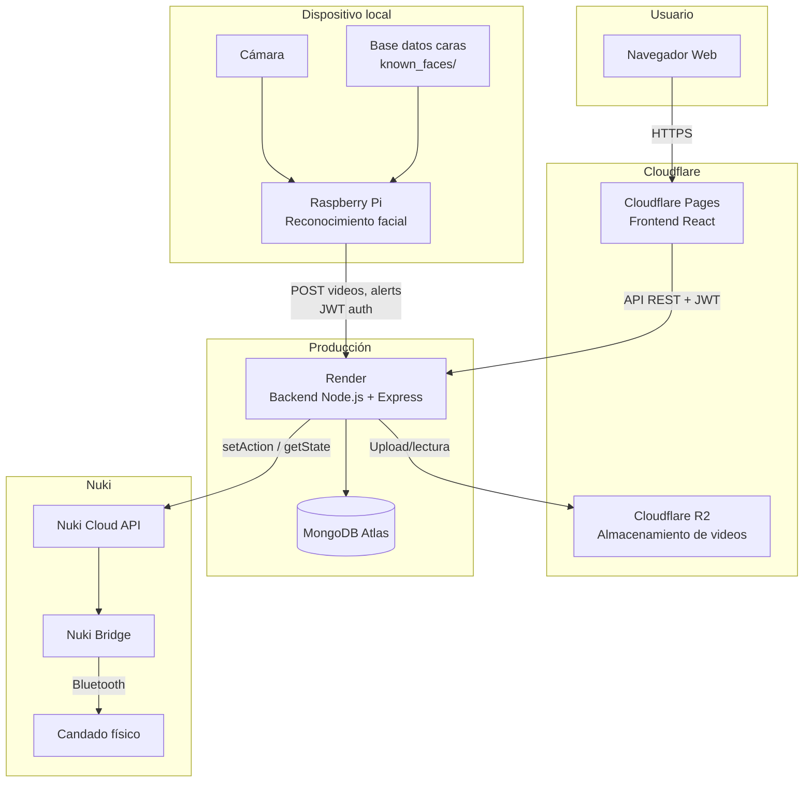
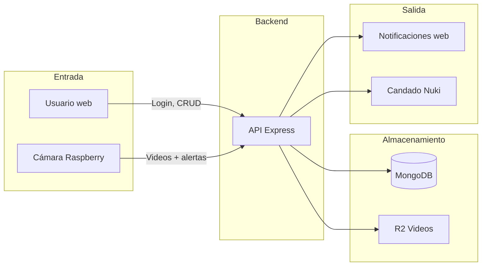

# GateLock - Arquitectura y Presentación

## Diagrama de Arquitectura

## Flujo de datos simplificado

---

# Presentación para Stakeholders (5 minutos)

## Slide 1: ¿Qué es GateLock? (30 seg)

**GateLock** es un sistema de control de acceso con **reconocimiento facial** para espacios como viviendas, oficinas o accesos restringidos.

Permite:
- Detectar y reconocer personas frente a una cámara
- Recibir alertas en tiempo real cuando alguien llega
- Abrir o cerrar un candado inteligente (Nuki) desde el móvil o el ordenador
- Consultar el historial de accesos con videos asociados

---

## Slide 2: Componentes principales (1 min)

| Componente | Tecnología | Dónde corre |
|------------|------------|-------------|
| **App web** | React + TypeScript | Cloudflare Pages (CDN global) |
| **API** | Node.js + Express | Render (cloud) |
| **Base de datos** | MongoDB Atlas | Cloud |
| **Videos** | Cloudflare R2 | Almacenamiento objeto |
| **Reconocimiento facial** | Python + InsightFace | Raspberry Pi (en sitio) |
| **Candado** | Nuki Smart Lock | Físico en la puerta |

La Raspberry Pi es el único elemento que debe estar en el lugar; el resto está en la nube.

---

## Slide 3: Flujo de uso (1 min 30 seg)

1. **Registro** – El usuario crea cuenta en la app web.
2. **Personas** – Se añaden fotos de las personas autorizadas; la Raspberry construye una base de datos local de caras.
3. **Detección** – La Raspberry detecta rostros, graba un clip y lo sube a la nube.
4. **Notificación** – El usuario recibe una alerta en la app con el nombre (si es conocido) o “Persona desconocida”.
5. **Decisión** – El usuario puede aceptar (el candado se abre) o ignorar.
6. **Historial** – Todas las alertas quedan guardadas con su video para revisión posterior.

---

## Slide 4: Características destacadas (1 min)

- **Reconocimiento facial** con InsightFace (detección + identificación).
- **Videos en la nube** – Los clips se almacenan en R2, no en el dispositivo.
- **Control remoto del candado** – Apertura/cierre desde cualquier lugar con la app.
- **Diseño responsive** – Uso en móvil y escritorio.
- **Modo oscuro** incluido.
- **Despliegue en producción** con dominio propio, HTTPS y escalado en la nube.

---

## Slide 5: Estado actual y próximos pasos (30 seg)

**Estado**: Sistema en producción, desplegado y operativo.

**Posibles mejoras**:
- Notificaciones push en el móvil
- Sincronización automática de la base de caras entre app y Raspberry
- Soporte para varios candados o zonas

---

## Métricas para mencionar (opcional)

- **Tiempo de respuesta** del candado: ~10–15 segundos (depende de Nuki Cloud).
- **Actualización del estado** del candado: cada 5 segundos.
- **Videos**: hasta 100 MB por clip, almacenados en R2 (10 GB gratis al mes).
